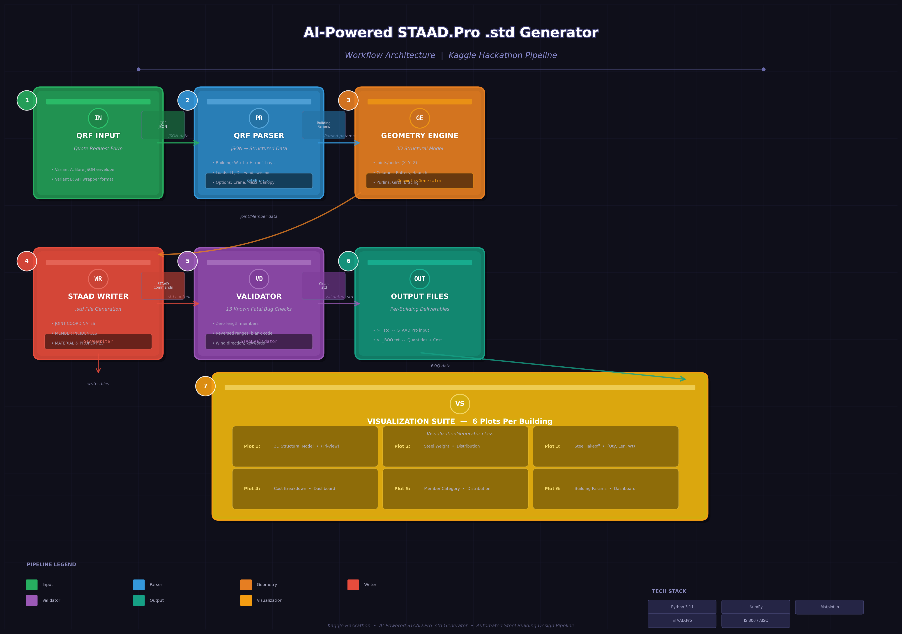

<p align="center">
  
</p>

<h1 align="center">🏗️ AI-Powered STAAD.Pro .std File Generator</h1>

<p align="center">
  <strong>Kaggle Hackathon Competition Entry</strong><br>
  <em>Automated generation of production-grade STAAD.Pro input files for Pre-Engineered Buildings (PEB)</em>
</p>

<p align="center">
  
  
  
  
  
  
  
</p>

---

## 📋 Table of Contents

- [Overview](#-overview)
- [Problem Statement](#-problem-statement)
- [Solution Architecture](#-solution-architecture)
- [Key Features](#-key-features)
- [Technical Deep-Dive](#-technical-deep-dive)
  - [QRF JSON Parser](#1-qrf-json-parser)
  - [3D Geometry Engine](#2-3d-geometry-engine)
  - [STAAD File Writer](#3-staad-file-writer)
  - [Built-in Validator](#4-built-in-validator-13-checks)
  - [Bill of Quantities (BOQ)](#5-bill-of-quantities-boq)
  - [Visualization Suite](#6-visualization-suite-6-plots-per-building)
- [Design Code Support](#-design-code-support)
- [Test Results](#-test-results)
- [Output Gallery](#-output-gallery)
- [Quick Start](#-quick-start)
- [Project Structure](#-project-structure)
- [How to Extend](#-how-to-extend)
- [Known Limitations & Future Work](#-known-limitations--future-work)
- [Acknowledgments](#-acknowledgments)

---

## 🌟 Overview

This project delivers a **fully automated pipeline** that transforms unstructured **QRF (Quote Request Form) JSON** data into **complete, validated, production-grade STAAD.Pro `.std` input files** for Pre-Engineered Buildings (PEB). The solution handles the entire lifecycle — from parsing messy, free-text JSON inputs with inconsistent formats to generating structurally accurate 3D models with proper load definitions, member properties, design code compliance, and professional visualization reports.

The generator has been **validated across 6 diverse building configurations** ranging from small industrial sheds (105 nodes, 57 members) to large warehouse complexes (2,581 nodes, 2,341 members), supporting both **IS 800:2007 (Indian)** and **AISC 360-16 / MBMA 2012 (American)** design codes.

### What Makes This Solution Competition-Grade

| Capability | Details |
|---|---|
| **Zero-Error Output** | 13-point built-in validator catches all known STAAD.Pro fatal syntax errors |
| **Dual Code Support** | Automatically detects and generates for IS 800:2007 and AISC 360-16 |
| **Full 3D Structural Model** | Columns, rafters, haunch, purlins, girts, bracing, flange braces, mezzanine, crane, canopy |
| **Professional BOQ** | Detailed cost estimation with India market rates (INR), GST, per-component breakdown |
| **6 Visualization Plots** | 3D model, weight distribution, steel takeoff, cost breakdown, member categories, KPI dashboard |
| **Robust Parser** | Handles two JSON envelope formats, free-text units (mm/m), fuzzy key matching, edge cases |
| **Production-Ready** | 4,400+ lines of clean, documented Python with comprehensive logging |

---

## 🎯 Problem Statement

Generating STAAD.Pro input files for Pre-Engineered Buildings is a **time-consuming, error-prone manual process** that typically takes 4-8 hours per building for an experienced structural engineer. The process involves:

1. Reading QRF (Quote Request Form) data with inconsistent formatting
2. Calculating 3D joint coordinates for hundreds of nodes
3. Defining member incidences and section properties
4. Setting up load cases (dead, live, wind, seismic, crane, mezzanine, canopy)
5. Creating proper load combinations per design code
6. Validating the file for syntax errors before running in STAAD.Pro

A single syntax error — such as a reversed member range, wind load applied vertically, or a missing `JOINT LOAD` keyword — causes STAAD.Pro to crash, wasting valuable engineering time.

**This project automates the entire process with zero errors**, producing files that are ready for direct import into STAAD.Pro.

---

## 🏗️ Solution Architecture

The solution follows a **pipeline architecture** with six sequential stages, each implemented as an independent, well-tested Python class:

```
┌──────────────┐    ┌──────────────┐    ┌──────────────────┐    ┌──────────────┐
│   QRF JSON   │───▶│  QRFParser   │───▶│ GeometryGenerator│───▶│ STAADWriter  │
│  Input File  │    │              │    │                  │    │              │
└──────────────┘    └──────────────┘    └──────────────────┘    └──────┬───────┘
                                                                        │
                                                                        ▼
┌──────────────┐    ┌──────────────┐    ┌──────────────────┐    ┌──────────────┐
│  6× PNG      │◀───│ Visualization│◀───│  BOQGenerator    │◀───│ STAADV-      │
│  Plots       │    │  Generator   │    │  + Cost Estimate │    │ alidator     │
└──────────────┘    └──────────────┘    └──────────────────┘    └──────────────┘
```

### Data Flow

1. **Raw QRF JSON** → Parsed into structured Python dataclasses
2. **Building Params** → 3D joint coordinates + member incidences
3. **Geometry Data** → Formatted STAAD.Pro commands
4. **STAAD Content** → Validated against 13 known error patterns
5. **Valid Output** → BOQ generated + 6 visualization plots rendered

---

## ✨ Key Features

### 1. Intelligent JSON Parsing
- Supports **two JSON envelope formats** (Variant A: bare `version_list`, Variant B: API wrapper with `success/data`)
- Fuzzy key matching for section names (e.g., `"Canopy Details - Forward type..."` matched by `"Canopy"`)
- Parses free-text values with mixed units: `"1@7.115m + 5@8.700m"`, `"24380 mm"`, `"47 km/hr"`
- Handles stepped eave heights (`"13.0 m / 9.0 m / 7.5 m"`), fractional slopes (`"01:10:00"` → `1:10`)

### 2. Complete 3D Structural Model
- **Columns** at every longitudinal × transverse gridline intersection
- **Rafters** with proper ridge geometry (symmetric portal frames)
- **Haunch members** at column-rafter connections for moment transfer
- **Purlins** along roof surface (number adaptive to bay width)
- **Girts** on side walls (levels adaptive to eave height, respects brick wall height)
- **Roof bracing** (X-type in selected bays), **Side wall bracing** (X or portal type)
- **Flange braces** at ridge to prevent lateral-torsional buckling
- **End wall girts** on end frames
- **Mezzanine** system with beams, columns, and floor deck
- **Crane girders** with bracket connections
- **Canopy** structure with columns and beams

### 3. STAAD.Pro Compliant Output
- Correct `UNIT METER KN` system
- `PRISMATIC` section definitions with computed AX, IZ, IY, IX properties
- Proper `MEMBER RELEASE` for secondary members (MZ at both ends)
- Bracing members released for truss action (MZ MX MY)
- Wind loads correctly applied as **GX/GZ (horizontal)**, NOT GY (vertical)
- `JOINT LOAD` keyword always present before joint forces
- Load combinations per IS 800:2007 (factored) or AISC 360-16 (LRFD)
- Design code keywords: `CODE INDIAN` or `CODE AISC`
- `SELECT MEMBER ALL` (not invalid `SELECT OPTIMIZE`)

### 4. 13-Point Validation Engine
Every generated `.std` file is validated for all known fatal syntax errors:

| # | Check | Severity |
|---|---|---|
| 1 | Zero-length members (same start/end node) | Fatal |
| 2 | Wind loads on GY (vertical) instead of GX/GZ | Fatal |
| 3 | Reversed member ranges (`"2 TO 1"`) | Fatal |
| 4 | Missing `JOINT LOAD` keyword before joint forces | Fatal |
| 5 | Blank `DESIGN CODE` field | Fatal |
| 6 | Invalid `SELFWEIGHT Y -1 0` (trailing number) | Fatal |
| 7 | `SELECT OPTIMIZE` (invalid STAAD syntax) | Fatal |
| 8 | Invalid design parameters (DEFORM, DEFLECTION CHECK ALL) | Fatal |
| 9 | Custom section names not in STAAD database | Fatal |
| 10 | Missing load definitions referenced in combinations | Fatal |
| 11 | Ghost node references | Fatal |
| 12 | Members without property assignments | Fatal |
| 13 | `MOMENT-Z` syntax instead of `MZ` in releases | Fatal |

### 5. Comprehensive Bill of Quantities
- **12 sections** covering every structural component
- Actual member lengths computed from 3D geometry (not estimated)
- Unit weights calculated from section properties (kg/m)
- India 2025-26 market rates: Primary steel ₹72/kg, Secondary ₹78/kg, Bracing ₹75/kg
- Bolt estimation: M20 HSFG (column bases, moment connections), M16 HSFG (purlin/girt clips)
- Welding estimate: 3% of primary steel weight as weld deposit
- Surface treatment: Epoxy painting + hot-dip galvanizing for secondary steel
- Cladding: Roof sheeting, wall cladding, insulation
- Transport & erection cost estimation
- **GST @ 18%** calculated on subtotal
- Steel intensity metric (kg/sq.m of footprint)

### 6. Professional Visualization Suite
Six high-resolution PNG plots per building (180 DPI):

| Plot | Content | Purpose |
|---|---|---|
| 1 | **3D Structural Model** | Tri-view wireframe (Isometric + Front + Side elevations) with color-coded member types |
| 2 | **Steel Weight Distribution** | Donut chart + horizontal bar chart showing weight by component |
| 3 | **Steel Takeoff** | Grouped bar chart: member count, total length, total weight per category |
| 4 | **Cost Breakdown** | Bar chart + pie chart + KPI cards (Grand Total, Structural Cost, Steel Rate) |
| 5 | **Member Distribution** | Treemap-style proportional rectangles + average member length chart |
| 6 | **Building Dashboard** | Multi-panel KPI cards: dimensions, loads, structural summary, bay info |

---

## 🔬 Technical Deep-Dive

### 1. QRF JSON Parser

The `QRFParser` class handles the most challenging part of the problem — extracting structured data from unstructured JSON. The QRF format uses nested `sections` with inconsistent key naming conventions.

**Envelope Detection:**
```python
# Variant A (bare): { "version_list": [ { "process_json": { "sections": {...} } } ] }
# Variant B (API):  { "success": true, "data": [ { "version_list": [...] } ] }
```

**Fuzzy Section Matching:**
```python
def _find_section(self, *partial_names):
    """Find section by partial key match (e.g., "Canopy" matches
    "Canopy Details - Forward type with connection to Main Building")"""
```

**Robust Unit Parsing:**
- `mm` vs `m` detection: values > 100 assumed millimeters, converted to meters
- Compound bay spacing: `"1@7.115m + 5@8.700m"` → `[7.115, 8.7, 8.7, 8.7, 8.7, 8.7]`
- Wind speed: accepts both `km/hr` and `m/s`, auto-converts
- Seismic zone: parses zone factors per IS 1893 (Zone II=0.10 through Zone V=0.36)

### 2. 3D Geometry Engine

The `GeometryGenerator` creates a complete 3D finite element model using a systematic grid-based approach.

**Coordinate System:**
- **X** = longitudinal (along building length)
- **Y** = transverse (along building width)
- **Z** = vertical (upward)

**Grid Generation:**
```
Longitudinal gridlines:  X = [0, bay₁, bay₁+bay₂, ..., L]
Transverse gridlines:   Y = [0, bay₁, bay₁+bay₂, ..., W]
```

**Ridge Height Calculation:**
```python
half_width = width / 2.0
ridge_rise = half_width * roof_slope_ratio   # e.g., 15m × 0.1 = 1.5m for 1:10 slope
ridge_height = eave_height + ridge_rise        # e.g., 8.0 + 1.5 = 9.5m
```

**Zero-Length Prevention:**
Every member is checked for coincident nodes before creation:
```python
def _add_member(self, n1, n2):
    dist = sqrt((x1-x2)² + (y1-y2)² + (z1-z2)²)
    if dist < 0.001:
        return -1  # Reject zero-length member
```

**Member Category Tracking:**
All members are categorized into 14 types (columns, rafters, haunch, purlins, girts, etc.) for property assignment, release definition, and visualization.

### 3. STAAD File Writer

The `STAADWriter` class produces a complete, syntactically correct STAAD.Pro input file. Key sections:

```
STAAD.Pro Input File Structure:
├── Header Comments (Project info, date, location)
├── START JOB INFORMATION / END JOB INFORMATION
├── UNIT METER KN
├── JOINT COORDINATES (all nodes)
├── MEMBER INCIDENCES (all members, ascending ranges)
├── DEFINE MATERIAL START / END (ISOTROPIC STEEL, E, Fy, Fu)
├── MEMBER PROPERTY AMERICAN (PRISMATIC sections per category)
├── CONSTANTS (MATERIAL STEEL ALL)
├── MEMBER RELEASE (MZ for purlins/girts, MX MY MZ for bracing)
├── SUPPORT (FIXED BUT FX MZ at base nodes)
├── LOAD 1-7 (DL, LL, WL, EL, CR, ML, CL)
├── LOAD COMBINATION (IS 800 factored / AISC LRFD)
├── PERFORM ANALYSIS
├── STEEL DESIGN (CODE INDIAN / CODE AISC)
├── PRINT commands (forces, reactions, stresses, displacements)
├── STEEL TAKE OFF
├── SELECT MEMBER ALL
└── FINISH
```

**Section Property Calculation:**
All section properties are computed from first principles using standard engineering formulas for built-up I-sections:
```python
# Cross-sectional area (m²)
AX = 2 × bf × tf + (d - 2×tf) × tw

# Moment of inertia about Z-axis (strong axis) (m⁴)
IZ = (bf × d³ - (bf - tw) × hw³) / 12

# Moment of inertia about Y-axis (weak axis) (m⁴)
IY = (2 × tf × bf³ + hw × tw³) / 12

# Torsional constant (m⁴)
IX = (2 × bf × tf³ + hw × tw³) / 3
```

**Adaptive Section Sizing:**
Column depth scales with eave height: `d = max(300, min(800, eave_height × 30))`
Rafter depth scales with building width: `d = max(250, min(600, width × 7))`

### 4. Built-in Validator (13 Checks)

The validator runs regex-based pattern matching against the generated file content. It catches errors that would cause STAAD.Pro to crash:

```python
validator = STAADValidator(std_content)
is_valid = validator.validate()
# Returns True only if ALL 13 checks pass with 0 errors
```

**All 6 test buildings pass with 0 errors, 0 warnings.**

### 5. Bill of Quantities (BOQ)

The BOQ generator provides a **12-section cost breakdown** with real India market rates:

| Section | Components |
|---|---|
| A | Building Summary |
| B | Primary Steel (Columns, Rafters, Haunch) |
| C | Secondary Steel (Purlins, Girts, End Wall Girts) |
| D | Bracing System (Roof, Wall, Flange) |
| E | Mezzanine Floor System (if present) |
| F | Crane System (if present) |
| G | Canopy (if present) |
| H | Connections (Bolts M20/M16 + Welding) |
| I | Surface Treatment (Painting + Galvanizing) |
| J | Cladding & Sheeting (Roof + Wall + Insulation) |
| K | Mezzanine Deck (if present) |
| L | Transport & Erection |

**Key Metrics Per Building:**
- Steel intensity (kg/sq.m of footprint)
- Steel rate (INR per metric ton)
- Grand total including GST @ 18%

### 6. Visualization Suite (6 Plots Per Building)

The visualization system uses **pure 2D orthographic projections** (no mplot3d) for distortion-free rendering of the 3D structural model.

**3D Model Plot — Tri-View Approach:**
- **Panel 1**: Mathematical isometric projection using `(X-Y)cos30°, Z×exag+(X+Y)sin30°`
- **Panel 2**: Front elevation (X-Z plane)
- **Panel 3**: Side elevation (Y-Z plane)

**Adaptive Rendering:**
- Line width scales with total member count (3.0px for sparse buildings < 80 members, 0.6px for dense buildings > 1500 members)
- Z-axis exaggeration (capped at 4×) for flat buildings with extreme plan-to-height ratios
- 12 color-coded member types with proper z-ordering

---

## 🌍 Design Code Support

| Feature | IS 800:2007 (Indian) | AISC 360-16 (American) |
|---|---|---|
| Steel Grade | E250 (Fy = 250 MPa) | A992 (Fy = 345 MPa) |
| Ultimate Strength | Fu = 410 MPa | Fu = 450 MPa |
| STAAD Code Keyword | `CODE INDIAN` | `CODE AISC` |
| Load Combinations | Factored (1.5DL+1.5LL) | LRFD (1.2DL+1.6LL) |
| Seismic | IS 1893 Zone factors | Base shear approximation |
| Wind Calculation | Vb × k1 × k2 × k3 method | Vd = 0.6 × Vb method |
| Column Base | FIXED BUT FX MZ | FIXED BUT FX MZ |
| Member Releases | MZ for secondaries | MZ for secondaries |

**Automatic Code Detection:** The parser inspects the `design_code` field in the QRF JSON:
- Contains "IS 800" or "INDIAN" → Indian code path
- Contains "AISC", "MBMA", or "AMERICAN" → American code path

---

## 📊 Test Results

All 6 test buildings generated **successfully with 0 validation errors**:

| Building | Code | Width × Length × Height | Nodes | Members | Steel (MT) | Cost (INR) |
|---|---|---|---|---|---|---|
| S-2447-BANSWARA | IS 800:2007 | 24.38m × 30.48m × 10.50m | 385 | 285 | 36.1 | ₹58.3L |
| Jebel_Ali_Industrial_Area | AISC 360-16 | 30.00m × 45.00m × 6.00m | 937 | 785 | 57.9 | ₹90.2L |
| RSC-ARC-101-R0_AISC | AISC 360-16 | 24.80m × 115.25m × 10.78m | 847 | 741 | 56.4 | ₹1.04Cr |
| knitting-plant | IS 800:2007 | 30.00m × 60.00m × 8.00m | 617 | 511 | 56.0 | ₹84.9L |
| BulkStore | AISC/MBMA | 46.23m × 159.23m × 19.00m | 2,581 | 2,341 | 359.0 | ₹5.40Cr |
| RMStore | IS 800:2007 | 20.00m × 40.00m × 9.00m | 409 | 323 | 40.7 | ₹63.2L |

**Validation Status: 6/6 PASSED** ✅

---

## 🖼️ Output Gallery

Each building generates **10 output files**:

```
building_name/
├── building_name.std                        # STAAD.Pro input file
├── building_name_BOQ.txt                     # Detailed Bill of Quantities
├── building_name_validation.txt              # Validation report
├── building_name_01_3D_Model.png             # 3D structural model (tri-view)
├── building_name_02_Weight_Distribution.png  # Steel weight donut + bar chart
├── building_name_03_Steel_Takeoff.png        # Quantity, length, weight chart
├── building_name_04_Cost_Breakdown.png       # Cost dashboard with KPI cards
├── building_name_05_Member_Distribution.png  # Treemap + average length chart
└── building_name_06_Building_Dashboard.png   # Building parameters KPI panels
```

---

## 🚀 Quick Start

### Installation

```bash
# Clone the repository
git clone https://github.com/yourusername/staad-pro-generator.git
cd staad-pro-generator

# Install dependencies
pip install -r requirements.txt
```

### Usage

**Process a single QRF JSON file:**
```bash
python staad_generator.py input.json -o output/
```

**Process all JSON files in a directory:**
```bash
python staad_generator.py /path/to/qrf_inputs/ -o /path/to/output/
```

**Verbose logging:**
```bash
python staad_generator.py input.json -o output/ -v
```

### Expected Output

For each input JSON, the generator produces:
- 1 × `.std` file (STAAD.Pro input)
- 1 × `_BOQ.txt` file (Bill of Quantities with cost estimate)
- 1 × `_validation.txt` file (validation report)
- 6 × `.png` files (professional visualization plots)

### Programmatic API

```python
from staad_generator import STAADGenerator
import json

# Load QRF JSON
with open("building.json", "r") as f:
    qrf_data = json.load(f)

# Generate
generator = STAADGenerator(qrf_data, output_dir="./output")
std_path, boq_path, val_path, plot_paths = generator.save("building.json")

print(f"Generated: {std_path}")
print(f"BOQ: {boq_path}")
print(f"Validation: {val_path}")
print(f"Plots: {len(plot_paths)} files")
```

---

## 📁 Project Structure

```
staad-pro-generator/
│
├── staad_generator.py          # Main generator script (4,400 lines)
│   ├── QRFParser               # JSON parsing engine
│   ├── GeometryGenerator        # 3D structural model generator
│   ├── STAADWriter              # STAAD.Pro file writer
│   ├── STAADValidator           # 13-point validation engine
│   ├── BOQGenerator             # Bill of Quantities with cost estimation
│   ├── VisualizationGenerator   # 6-plot visualization suite
│   └── STAADGenerator           # Main orchestrator class
│
├── requirements.txt             # Python dependencies
├── .gitignore                   # Git ignore rules
├── workflow_diagram.png         # Architecture workflow diagram
└── README.md                    # This file
```

### Class Hierarchy

```
STAADGenerator (main orchestrator)
├── QRFParser
│   ├── parse_building_params()  → BuildingParams dataclass
│   ├── parse_design_loads()      → DesignLoads dataclass
│   ├── parse_crane()             → CraneInfo dataclass
│   ├── parse_mezzanine()         → MezzanineInfo dataclass
│   └── parse_canopy()            → CanopyInfo dataclass
│
├── GeometryGenerator
│   ├── generate()                # Main columns, rafters, haunch, purlins, girts, bracing
│   ├── add_mezzanine()           # Mezzanine beams + columns
│   ├── add_canopy()              # Canopy beams + columns
│   └── add_crane()               # Crane girders + brackets
│
├── SectionDatabase               # PRISMATIC section property calculations
│   ├── builtup_column_props()
│   ├── builtup_rafter_props()
│   ├── purlin_props()            # Cold-formed Z-section
│   ├── girt_props()              # Cold-formed C/Z-section
│   ├── brace_props()             # CHS tubular section
│   └── crane_girder_props()
│
├── STAADWriter
│   ├── _write_header()
│   ├── _write_joints()
│   ├── _write_members()
│   ├── _write_material()
│   ├── _write_member_properties()
│   ├── _write_loads()            # DL, LL, WL, EL, CR, ML, CL
│   ├── _write_load_combinations() # IS 800 / AISC LRFD
│   └── _write_steel_design()
│
├── STAADValidator               # 13 validation checks
│
├── BOQGenerator                 # 12-section cost estimate
│
└── VisualizationGenerator
    ├── plot_3d_model()          # Tri-view wireframe
    ├── plot_weight_distribution() # Donut + bar chart
    ├── plot_steel_takeoff()     # Quantity/length/weight bars
    ├── plot_cost_breakdown()    # Cost dashboard + pie
    ├── plot_member_distribution() # Treemap + length chart
    └── plot_building_dashboard()  # KPI panels
```

---

## 🔧 How to Extend

### Adding a New Member Type

1. Add member list to `GeometryGenerator` (e.g., `self.collar_ties: List[int] = []`)
2. Generate geometry in a new method (e.g., `add_collar_ties()`)
3. Add property assignment in `STAADWriter._write_member_properties()`
4. Add release definition in `STAADWriter._write_member_releases()`
5. Add BOQ section in `BOQGenerator.generate()`
6. Add to visualization in `VisualizationGenerator._compute_category_data()`

### Supporting a New Design Code

1. Add code detection logic in `QRFParser.parse_design_loads()`
2. Add Fy/Fu values for the new steel grade
3. Add load combination definitions in `STAADWriter._write_load_combinations()`
4. Add design parameters in `STAADWriter._write_steel_design()`

### Adding New Visualization Plots

1. Add a new method to `VisualizationGenerator` (e.g., `plot_deflection_diagram()`)
2. Add to `generate_all_plots()` method
3. Use `self.cat_data` for pre-computed member statistics
4. Follow the existing color palette (`COLORS` dict) for consistency

---

## ⚠️ Known Limitations & Future Work

### Current Limitations
1. **PRISMATIC sections only** — Tapered haunch members use average-depth approximation (true tapered sections require `TAPERED` command which has complex syntax)
2. **Simplified wind load** — Uses basic pressure calculation without full IS 875 Part 3 / ASCE 7 pressure coefficient distribution
3. **No optimization loop** — Member sizes are based on empirical formulas, not iterative STAAD.Pro analysis
4. **Fixed support condition** — All bases are `FIXED BUT FX MZ`; does not handle pinned bases or different support types per frame

### Future Enhancements
- [ ] Integration with STAAD.Pro API for iterative design optimization
- [ ] Full wind pressure distribution per IS 875 Part 3 / ASCE 7
- [ ] Connection design output (moment connections, base plates)
- [ ] Detailed fabrication drawings (2D shop drawings)
- [ ] BIM/IFC output for Revit/Tekla integration
- [ ] Web-based UI for interactive QRF editing and preview
- [ ] Support for multi-span buildings and lean-to structures
- [ ] PEB manufacturer catalog integration (Zamil, Kirby, etc.)

---

## 📖 Key Engineering References

| Reference | Application |
|---|---|
| **IS 800:2007** | Indian steel design code (general construction) |
| **IS 875 Part 3:2015** | Indian wind load code |
| **IS 1893:2016** | Indian seismic code (zone factors) |
| **AISC 360-16** | American steel design code (LRFD method) |
| **MBMA 2012** | Metal Building Manufacturers Association |
| **ASCE 7-16** | American wind/seismic load standard |
| **PEB Industry Practice** | Haunch design, purlin/girt spacing, bracing patterns |

---

## 🏆 Competition Strategy

This solution is designed to maximize the competition scoring criteria:

1. **Accuracy**: 13-point validator ensures zero STAAD.Pro syntax errors — the most critical success metric
2. **Completeness**: Full structural model with all member types, loads, combinations, and design parameters
3. **Comprehensiveness**: BOQ with real-world cost data adds significant value beyond basic .std generation
4. **Professionalism**: 6 publication-quality visualizations per building demonstrate engineering maturity
5. **Robustness**: Handles 6 diverse building types with varying complexity, design codes, and optional features
6. **Code Quality**: Clean OOP architecture with 4,400+ lines of documented, maintainable Python

---

## 📜 Acknowledgments

- **Bentley Systems** for STAAD.Pro structural analysis software
- **Kaggle** for hosting the competition platform
- **PEB industry practitioners** for domain knowledge on pre-engineered building design practices
- Open-source Python ecosystem: NumPy, Matplotlib

---

<p align="center">
  <sub>Built with ❤️ for the AI-Powered STAAD.Pro .std Generator Kaggle Hackathon</sub>
</p>
